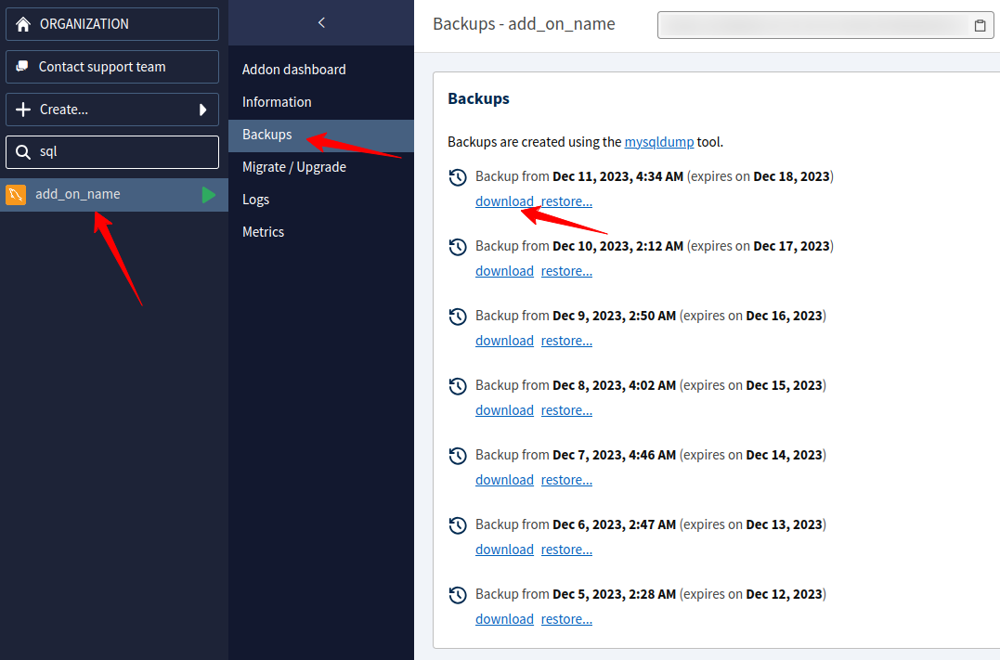
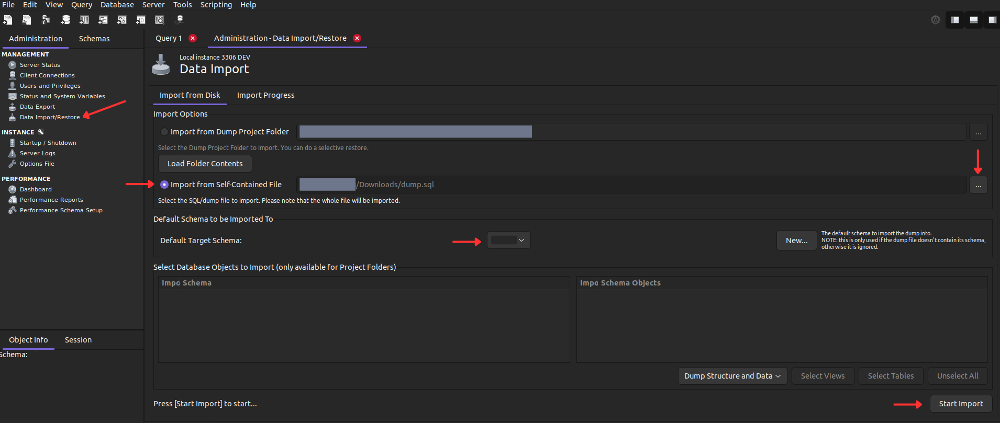

# Clever Cloud

We use **Clever Cloud** has our main PaaS of choice to deploy our project.
Here is a compilation of doc about to interact between the infra stack of the project and Clever Cloud.

## Install the Clever Cloud CLI

We use the **Clever Cloud CLI** for linking project repository to Clever Cloud application and for ssh into them.  
The easiest method to install it is via npm by typing :

```shell
npm install -g clever-tools
```

You can use the same install command to update your current version of the CLI.

_More information about the [Clever Cloud CLI here](https://developers.clever-cloud.com/doc/cli/)_

## Import a backup from a Clever Cloud add-on down to a local project

Sometimes, we must import distant server SQL database to check unexpected behavior with our local debugging tools.    
That why each developer needs to know this procedure in order to be independent for such intervention. 

1. First find your add-on from the Clever Cloud console, then click on the Backups menu to list all available dumps and click on the download link you want to import.



Check the type of the downloaded file.  
If it's a `.gz`, you can extract it with the following command :

```bash
zcat mysql_idXXXXXX.sql.gz > dump.sql
```

2. Now empty your current local database using the following Makefile command:

```bash
# ssh into the php container of the local project stack
make ssh
# and then recreate the database
make orm-db-recreate
```

_This will recreate an empty database and ease import by not having any `CREATE TABLE` collision._ 

3. Then open **MySQL Workbench**, click on your configured local connection, then on left panel choose _Administration > Management > Data Import/Restore_.



- On **Import Options** select Import from Self-Contained File and select your download dump.sql via the "..." button
- On **Default Target Schema** select the database name of the project
- Then click on the **Start Import** button

When you see the line "Import of /home/user/Downloads/dump.sql has finished" on the Log screen that mean MySQL Workbench has correctly imported the dump.

4. Finally, check that your ORM is still in sync with imported database with the following command

```bash
make orm-status
# if there is any migration that needs to be processed, run the final command
make orm-update
```

You are now good to debug the downloaded server database on your local machine!

## Link the project to Clever Cloud application

> Be sure to [have the Clever Cloud CLI install](https://github.com/smartbooster/symfony-docker/blob/main/docs/clevercloud.md#install-the-clever-cloud-cli) first.

1. Use the following command to link the project to a dedicated Clever Cloud application

```shell
# Get the app id from the Clever Cloud console on the application overview and replace the app_XXX placeholder by his value
clever link app_XXX
```

This will add the application deploy config to the `.clever.json` file.  
This file needs to be committed to the project repository to be parsed by the CD GitLab jobs.

2. Then refer to the .gitlab-ci .yml file and add the dedicated application `deploy-{environment}` and `restart-{environment}` jobs with their correct `url`.

You can now deploy your project through the GitLab CD jobs.

## Knows issues

### Apache won't correctly set the Transfer-Encoding and Content-Length headers

If the Apache version on the VM of CleverCloud is equal or higher than v2.4.59 it won't automatticaly set the following headers :
- Transfer-Encoding
- Content-Length

(cf. https://svn.apache.org/viewvc/httpd/httpd/branches/2.4.x/CHANGES?view=markup#l21)

This behavior can have some side effect when creating BinaryFileResponse for example if you need to pass those headers.

If you have issue with this specific problem, you can solve it by adding the following line in your `public/.htaccess` 

```apacheconf
<IfModule mod_rewrite.c>
    # ...
    SetEnvIfExpr "true" ap_trust_cgilike_cl=1
</IfModule>
```
